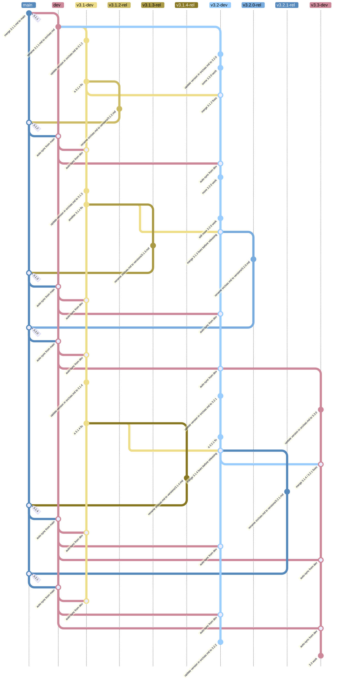

# Contribute to the OpenAPI Specification

## Key information

This project is covered by our [Code of Conduct](https://github.com/OAI/OpenAPI-Specification?tab=coc-ov-file#readme).
All participants are expected to read and follow this code.

No changes, however trivial, are ever made to the contents of published specifications (the files in the `versions/` folder).
Exceptions may be made when links to external URLs have been changed by a 3rd party, in order to keep our documents accurate.

Published versions of the specification are in the `versions/` folder.
The under-development versions of the specification are in the file `src/oas.md` on the appropriately-versioned branch.
For example, work on the next release for 3.2 is on `v3.2-dev` in the file `src/oas.md`.

The [spec site](https://spec.openapis.org) is the source of truth for the OpenAPI specification as it contains all the citations and author credits (the markdown in this repository was previously the authoritative version until 2024).

The OpenAPI project is almost entirely staffed by volunteers.
Please be patient with the people in this project, who all have other jobs and are active here because we believe this project has a positive impact in the world.

### Active branches

The current active specification releases are:

| Version | Branch | Notes |
| ------- | ------ | ----- |
| 3.1.2 | `v3.1-dev` | active patch release line |
| 3.2.0 | `v3.2-dev` | minor release in development |
| 4.0.0 | [OAI/sig-moonwalk](https://github.com/OAI/sig-moonwalk) | [discussions only](https://github.com/OAI/sig-moonwalk/discussions) |

## How to contribute

We welcome new contributors to the project whether you have changes to suggest, problems to report, or some feedback for us.
Please jump to the most relevant section from the list below:

- Ask a question or offer feedback: use a [discussion](#discussions)
- Suggest a change or report a problem: open an [issue](#issues)
- Contribute a change to the repository: open a [pull request](#pull-requests)
- Or just [get in touch](#get-in-touch)

## Discussions

We use [discussions](https://github.com/OAI/OpenAPI-Specification/discussions?discussions_q=is%3Aopen) for anything that doesn't (yet) have a specific action associated with it.
Most ideas start as discussions.

Please do come and start a discussion to:

- ask questions
- make suggestions
- give feedback

Anyone can start a discussion and you're very welcome to do so! Write a message and pick a relevant discussion category.

### Discussion management

Participation in discussions and especially answering of questions is encouraged (and appreciated) by everyone.

Discussions are closed when:

- the question has been answered.
- no further action or conversation would be useful.
- there has been no engagement for a while, or a previously popular thread has been inactive for an extended period.
- activity is now taking place elsewhere, such as in an issue.
- the discussion is out of scope for the project.

## Issues

Issues are for planned tasks, problems to solve, or requests for (specific) changes.
Most issues should have a clear outcome; something will be fixed, improved or otherwise measurably different when the issue is complete.

We use [discussions](#discussions) for ideas and early-stage suggestions.

> [!NOTE]
> For larger or more extensive changes, we have a formal [proposal process](#propose-a-specification-change) to give more structure where it's needed.

The best issues give a clear and concise explanation of the problem at hand, and ideally some examples of what the problem is.
Suggested solutions are also welcome, but it is very important that the issue outlines the problem that is being solved as well as the solution.
Some issues may be a backlog of a task that needs to be done; other issues might be automatically created as part of the project processes.

### Issue management

We have some issue automation to close inactive issues and create/pin/archive the weekly meeting issues.
More information is in the [Appendix: Issue automation](#appendix-issue-automation) section.

Everyone is encouraged to open and comment on issues in the project.
If you want to tag/assign/close something and you don't have enough permissions, add a comment and someone will help.

Issues are managed by the [Triage](#triage), [Maintainers](#maintainers) and [TSC](#tsc) teams.
They may move issues to other repositories within the project as needed.

In order to keep the issues list manageable and realistic for a relatively small group of volunteers, issues are proactively closed when it's not clear that they can be completed.
Issues may be closed when:

- they have been inactive for a long time
- they are out of scope or no further constructive action can be taken
- they are complete (yay!)
- they are unclear and more details are not forthcoming
- as a group, there is agreement that no further action will be taken

When issues are closed, a comment is added about why.
Closing issues is a reversible action, and it is always acceptable to comment and explain (politely) why an issue should not have been closed.

### Labels

We make extensive use of labels.
The main categories are:

- [Housekeeping](https://github.com/OAI/OpenAPI-Specification/labels/Housekeeping) for meetings, project logistics, etc.
- [approved pr port](https://github.com/OAI/OpenAPI-Specification/labels/approved%20pr%20port) for pull requests that repeat a change from one version to another
- most other tags are used to group similar or related issues into topic areas; this list is ever-changing

Labels related to [issue automation](#appendix-issue-automation)

- [Needs attention](https://github.com/OAI/OpenAPI-Specification/labels/Needs%20attention) automated tag when an issue is updated
- [Needs author feedback](https://github.com/OAI/OpenAPI-Specification/labels/Needs%20author%20feedback) used to indicate that more information is needed from the issue creator
- [No recent activity](https://github.com/OAI/OpenAPI-Specification/labels/No%20recent%20activity) if no information is received, the issue is marked for closure (automatic after 30 days)

### Milestones

We use milestones in GitHub to plan what should be included in future releases.
Issues and pull requests should both be added to the earliest milestone we expect they will be released in.
Any changes that aren't ready in time for release should be moved to the next milestone or untagged.

The milestones and items assigned to them are under constant review and subject to change.

### Projects

The OpenAPI Initiative uses GitHub Projects to manage work _outside_ of the specification development process.  There are currently two active projects:

* [Contributor Guidance](https://github.com/orgs/OAI/projects/5/views/1)
* [Automation & Infrastructure](https://github.com/orgs/OAI/projects/4/views/1)

## Pull requests

> [!NOTE]
> Since the 3.0.4 and 3.1.1 releases (October 2024), the OAS is developed in the `src/oas.md` file.
> Check the [Appendix: Branch Strategy](#appendix-branch-strategy) for more information about the updated branching strategy.

Changes to the next version of the specification are welcome and can be proposed by anyone.

For large changes that will need discussion, please use the [Proposal process](#propose-a-specification-change).
For other changes, we recommend [opening an issue](#issues) first, so that you can get some feedback and any extra input you need before spending a lot of time on something.

Schema changes are made on the same branch, but can be released independently.
When making a specification change for a new minor or major release that has a schema impact, including the schema change in the PR is preferred.
Patch releases cannot contain changes that _require_ a schema update.

### Use a fork

All work **MUST be done on a fork** and be submitted as a pull request.

### Target the earliest active `*-dev` branch

Branch from and submit pull requests to the a branch from the _earliest relevant and [active](#active-branches)_ `vX.Y-dev` branch.
For example, if a change applies to both 3.1 and 3.2, the PR would go to the `v3.1-dev` branch, which will be merged up to `v3.2-dev` before the next 3.2 release.
All changes to the specification must conform to the [style guide](./style-guide.md).

Both specification and schema changes follow this approach.

For changes to repository files that affect all versions, use the `main` branch.
This might apply to, for example, Markdown files, automation, and scripts.

For all pull requests, if they should not be merged yet for any reason (they depend on something else, you would like feedback from a specific reviewer), mark them as draft and they will not be merged while in that state.
Draft pull requests can still be reviewed while in draft state.

### Preview specification HTML locally

> [!NOTE]
> `npm run build-src` calls bash scripts. Use [Git Bash](https://gitforwindows.org/) on Windows, or use the Windows Subsystem for Linux (WSL).

The markdown source files are converted to HTML before publishing.
To do this locally, please

1. Install [Node.js](https://nodejs.org/)
2. Check out this repo, go to the repo root, and switch to a development branch
3. Execute `npm install` (once, repeat after merging upstream changes)
4. Execute `npm run build-src` after changing `src/oas.md` (this first executes `npm run validate-markdown`, which can also be run separately)
5. Open output file `deploy-preview/oas.html` with a browser and check your changes

Please make sure the markdown validates and builds using the above steps before creating a pull request or marking a draft pull request as ready for review.

## Reviewers

> [!NOTE]
> See also the detailed team outlines in the [roles section](#roles).

All pull requests must be reviewed and approved by one member of the TSC or Maintainers teams.
Reviews from other contributors are always welcome.

Additionally, all pull requests that change the specification file `src/oas.md` must be approved by two TSC members.

Reviews requesting changes should have their changes addressed regardless of how many other approvers there are.

## Publishing

### Specification Versions

The specification versions are published to the [spec site](https://spec.openapis.org) by creating an `vX.Y.Z-rel` branch where `src/oas.md` is renamed to the appropriate `versions/X.Y.Z.md` file and then merged to `main`.
This renaming on the `vX.Y.Z-rel` branch preserves the commit history for the published file on `main` when using `git log --follow` (as is the case for all older published files).

The steps for creating a `vX.Y.Z-rel` branch are:

1. Update `EDITORS.md` on `main`
2. Merge `main` into `dev` and `dev` into `vX.Y-dev` via PRs
   - sync PRs are automatically created by workflows `sync-main-to-dev` and `sync-dev-to-vX.Y-dev`
3. Prepare spec files in `vX.Y-dev`
   - `npm run format-markdown`
   - `npm run build-src`
   - open `deploy-preview/oas.html` in browser and verify correct formatting
   - adjust and repeat until done
   - merge changes to `src/oas.md` back into `vX.Y-dev` via PR
4. Create `vX.Y.Z-rel` from `vX.Y-dev` and adjust it
   - move `src/oas.md` to `versions/X.Y.Z.md`
   - copy `EDITORS.md` to `versions/X.Y.Z-editors.md`
   - delete `src/schemas`
   - delete `tests/schema`
   - bash script `scripts/adjust-release-branch.sh` performs these steps
5. Merge `vX.Y.Z-rel` into `main` via PR
   - this PR should only add files `versions/X.Y.Z.md` and `versions/X.Y.Z-editors.md`

The HTML renderings of the specification versions are generated from the `versions` directory on `main` by manually triggering the [`respec` workflow](https://github.com/OAI/OpenAPI-Specification/blob/main/.github/workflows/respec.yaml), which generates a pull request for publishing the HTML renderings to the [spec site](https://spec.openapis.org).

### Schema Iterations

The schema iterations are published independently from the specification releases [in the schema section on the spec site](https://spec.openapis.org/#openapi-specification-schemas).
Schemas are updated in and directly published from the `vX.Y-dev` branches.

As part of the publishing process, the YAML source files are converted to JSON, renamed to the relevant last-changed dates, and `WORK-IN-PROGRESS` placeholders are replaced with these dates as appropriate. This is usually done by the `schema-publish` workflow which detects changes on each `vX.Y-dev` branch, which generates a pull request for publishing the new schema iterations to the [spec site](https://spec.openapis.org). The workflow can also be run manually if required.

## Release Process and Scope

This section relates to the 3.x versions only.

### Minor Releases

Our roadmap for 3.x releases is community-driven, meaning the specification is open for proposed additions by anyone (see [Propose a Specification Change](#propose-a-specification-change)), in addition to the issues already on the project backlog.

Changes in minor releases (such as 3.2, 3.3) meet the following criteria:

* Are **backwards-compatible** and be reasonably easy to implement in tooling that already supports the previous minor version.
  For example, new optional fields can be added.
* Drive quality-of-life improvements to support how OpenAPI is used by practitioners, so that OpenAPI evolves to continue to meet user needs.
  For example, adding fields to support changes in other standards, or adopting common `x-*` extension fields into the specification.
* Bring the future closer by making changes that are in line with future 3.x releases and the planned OpenAPI 4.x (Moonwalk) specification as the details of that become available.
* Make the specification document clearer or easier to understand.

A minor release is due when there are some meaningful features (including one or a small number of headline features).

### Patch Releases

Patch releases reflect a constant quest for improving the active minor versions of OpenAPI.
Since we do not edit specification documents after publication, even the smallest change has to be in a new release.

Changes in patch releases meet the following criteria:

* Editorial changes such as spelling or formatting fixes, including link updates.
* Clarifications or additions that do not change the meaning of the specification.

Patch releases are created as often as there are changes to the specification worth releasing.

### Release Process

A release requires a vote on the specification at a particular version and the associated release notes by TSC members within the voting period.
Major or minor release voting periods will be announced in the Slack channel and noted on the calendar at least 6 days in advance.
During this time, TSC members who have not yet voted must note their approval by leaving a comment on the GitHub pull request proposing the release; release notes should be included with the description.
TSC members are responsible for coordinating the information about the release to the outreach team as appropriate.

* Patch-level releases require majority approval by TSC members. (Max voting period 3 days)

* Minor: requires approval by 66% of TSC members. (Max voting period 7 days)

* Major: requires approval by 66% of TSC members. (Max voting period 14 days)

During the voting period, further changes should not be made to the specification being considered.

Once the threshold of approvals is met, the release can be performed by any TSC member.

## Propose a Specification Change

As an organisation, we're open to changes, and these can be proposed by anyone.
The specification is very widely adopted, and there is an appropriately high bar for wide appeal and due scrutiny as a result.
We do not accept changes lightly (but we will consider any that we can).

Small changes are welcome as pull requests.

Bigger changes require a more formal process.

1. Start a [discussion](https://github.com/OAI/OpenAPI-Specification/discussions) of type "Enhancements".
   The discussion entry must include some use cases, your proposed solution and the alternatives you have considered.
   If there is engagement and support for the proposal over time, then it can be considered as a candidate to move to the next stage.

2. It really helps to see the proposed change in action.
   Start using it as a `x-*` extension if that's appropriate, or try to bring other evidence of your proposed solution being adopted.

3. If you are adding support for something from another specification (such as OAuth), please point to implementations of that
   specification so that we can understand how, and to what degree, it is being used.

4. If the suggested change has good support, you will be asked to create a formal proposal.
   Use the [template in the proposals directory](https://github.com/OAI/OpenAPI-Specification/tree/main/proposals), copy it to a new file, and complete it.
   Once you the document is ready, open a pull request on the main branch.

5. The proposal will be more closely reviewed and commented on or amended until it is either rejected or accepted.
   At that point, the proposal is merged into the `main` branch and a pull request is opened to add the feature to the appropriate `dev` version of the specification.

Questions are welcome on the process at any time. Use the discussions feature or find us in Slack.

## Roles

The OpenAPI project has some key roles that are played by multiple people.

### TSC

The Technical Steering Committee are listed in the [MAINTAINERS file](./MAINTAINERS.md).
They are the maintainers of the OpenAPI Specification itself and every other aspect of the project operation and direction.
TSC members can review changes to all parts of the repository and make decisions about the project.

### Maintainers

The maintainers have write access to the repository and play a key role in the project.
They review pull requests to non-specification parts of the repository, and take on other strategic tasks around project planning and maintenance.

### Triage

The triage team are active OpenAPI members who help with discussion and issue management.
They respond to new issues and discussions, direct people to our existing resources or raise conversations to a wider audience.
The triage team keeps an eye on the backlog and closes issues and discussions that are no longer active or needed.

## Get in touch

To get in touch with other people on the project, ask questions, or anything else:

- Find us [on the OpenAPI Slack](https://communityinviter.com/apps/open-api/openapi).
- Start a [GitHub Discussion](https://github.com/OAI/OpenAPI-Specification/discussions/).
- Join one of our weekly meetings by checking the [issues list for an upcoming meetings](https://github.com/OAI/OpenAPI-Specification/issues?q=is%3Aissue%20state%3Aopen%20label%3AHousekeeping).

## Appendix: Branch strategy

For information on the branch and release strategy for OAS 3.0.4 and 3.1.1 and earlier, see the comments in [issue #3677](https://github.com/OAI/OpenAPI-Specification/issues/3677).

### Branch roles

* `main` is used to publish finished work and hold the authoritative versions of general documentation such as this document, which can be merged out to other branches as needed.  The `src` tree is _**not**_ present on `main`.
* `dev` is the primary branch for working with the `src` tree.  Development infrastructure that is not needed on `main` is maintained here, and can be merged out to other non-`main` branches as needed.
  Changes on `main` are automatically included in a pull request to `dev` (see the (section on [branch sync](#branch-sync-automation)).
* `vX.Y-dev` is the minor release line development branch for X.Y, including both the initial X.Y.0 minor version and all subsequent X.Y.Z patch versions.  All PRs are made to oldest active `vX.Y-dev` branch to which the change is relevant, and then merged forward as shown in the diagram further down in this document.
* `vX.Y.Z-rel` is the release branch for an X.Y.Z release (including when Z == 0).  It exists primarily for `git mv`-ing `src/oas.md` to the appropriate `versions/X.Y.Z.md` location before merging back to `main`, and can also be used for any emergency post-release fixes that come up, such as when a 3rd party changes URLs in a way that breaks published links.

### Branching and merging (3.1.2, 3.2.0, and later)

Upon release:

* Pre-release steps:
  * The most recent _published_ patch release from the previous line is merged up to `vX.Y-dev`, if relevant
  * If doing simultaneous releases on multiple lines, do them from the oldest to newest line
  * For example, if releasing 3.1.3 and 3.2.0:
    * release 3.1.3 first
    * release 3.2.0 second
* Release branching and merging:
  * branch `vX.Y.Z-rel` from `vX.Y-dev` (same commit that was merged to `dev` if relevant)
  * After renaming `src/oas.md` to `versions/X.Y.Z.md` and [other adjustments](#specification-versions), merge `vX.Y.Z-rel` to `main`
* Publishing to the [spec site](https://spec.openapis.org) is triggered by the merge to `main`
* Post-release steps:
  * If this was a major or minor release (Z == 0), branch `vX.Y+1-dev` from `vX.Y-dev`

_Release lines are grouped by color, although the colors of `dev` and `main` are not significant as these diagrams are limited to only 8 colors._

### Branch sync automation

To keep changes in sync, we have some GitHub actions that open pull requests to take changes from `main` onto the `dev` branch, and from `dev` to each active version branch.

- `sync-main-to-dev` opens a pull request with all the changes from the `main` branch that aren't yet included on `dev`.
- `sync-dev-to-vX.Y-dev` opens pull requests with all the changes from `dev` that aren't yet included on the corresponding `vX.Y-dev` branch.

These need a single approval from either maintainers or TSC and can be merged.
The aim is to bring build script and repository documentation changes to the other branches.
Published versions of the specifications and schemas will also move across branches with this approach.

## Appendix: Issue Automation

### Automated closure of issues Process

In an effort to keep the list of issues up to date and easier to navigate through, issues get closed automatically when they become inactive.

This process makes use of the following labels:

* `Needs author feedback`: the issue has been replied to by the triage team and is awaiting a follow up from the issue's author. This label needs to be added manually by people doing triage/experts whenever they reply. It's removed automatically by the workflow.
* `No recent activity`: the issue hasn't received a reply from its author within the last 10 days since `Needs author feedback` was added and will be closed within 28 days if the author doesn't follow up. This label is added/removed automatically by the workflow.
* `Needs attention`: The issue's author has replied since the `Needs author feedback` label was set and the triage team will reply as soon as possible. This label needs to be removed manually by people doing triage/experts whenever they reply. It's added automatically by the workflow.

### Automated TDC agenda issues Process

An issue is opened every week, 7 days in advance, for the Technical Developer Community (TDC), it provides the information to connect the meeting, and serves as a placeholder to build the agenda for the meeting. Anyone is welcome to attend the meeting, or to add items to the agenda as long as they plan on attending to present the item. These issues are also automatically pinned for visibility and labeled with "Housekeeping".

Ten (10) days after the meeting date is passed (date in the title of the issue), it gets closed and unpinned automatically.

