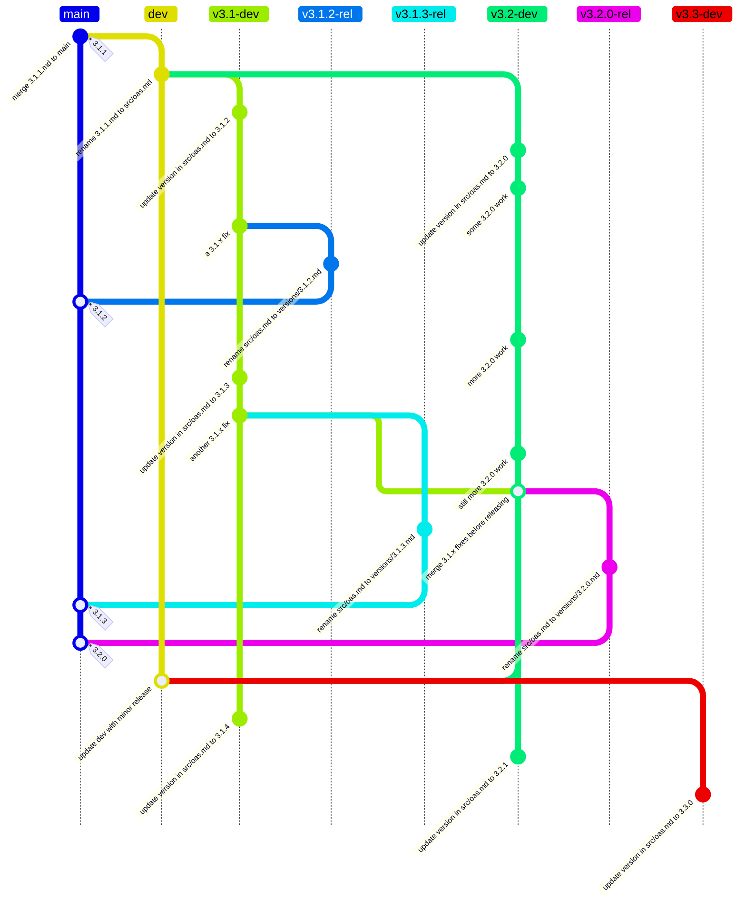

# Contributing to the OpenAPI Specification

***Work in progress!**  Each section links to issues that are relevant to fill out the rest of this document.*

We are currently working on [defining and documenting our new processes](https://github.com/orgs/OAI/projects/5).  Information in this document is up-to-date.  Older _(and sometimes now inaccurate)_ documentation can be found in [DEVELOPMENT.md](DEVELOPMENT.md), which will be removed when everything is updated and documented here.

## Essential Policies

This section serves as a quick guide while we work on the full updated documentation.

If in doubt about a policy, please [ask on our Slack](https://communityinviter.com/apps/open-api/openapi) before opening a PR.

### No changes to published specifications

No changes, ***no matter how trivial***, are ever made to the contents of published specifications.  The only potential changes to those documents are updates to link URLs _if and only if_ the targeted document is moved by a 3rd party.  Other changes to link URLs are not allowed.

### Changing the schemas

Schemas are only changed _after_ the specification is changed.
Changes are made to the YAML versions on the `main` branch.
The JSON versions are generated when published to the [spec site](https://spec.openapis.org/), at which time the `WORK-IN-PROGRESS` URI placeholders are replaced with the publication date.

### Authoritative source of truth

The [spec site](https://spec.openapis.org) is the source of truth.

This changed in 2024, as the markdown files on `main` do not include certain credits and citations.

## Development and publication process

As of October 2024 (post-OAS 3.0.4 and 3.1.1), the OAS is developed in the `src/oas.md` file on minor release `X.Y-dev` branches that are derived from the baseline `dev` branch.

All work **MUST be done on a fork**, using a branch from the _earliest relevant and [active](#active-branches)_ `X.Y-dev` branch, and then submitted as a PR to that `X.Y-dev` branch.
For example, if a change in November 2024 apples to both 3.1 and 3.2, the PR would go to the `v3.1-dev` branch, which will be merged up to `v3.2-dev` before the next 3.2 release.

Releases are published to the [spec site](https://spec.openapis.org) by creating an `X.Y.Z-rel` branch where `src/oas.md` is renamed to the appropriate `versions/X.Y.Z.md` file and them merged to `main`.  The HTML versions of the OAS are automatically generated from the `versions` directory on `main`.  This renaming on the `X.Y.Z-rel` branch preserves the commit history for the published file on `main` when using `git log --follow` (as is the case for all older published files).

For information on the branch and release strategy for OAS 3.0.4 and 3.1.1 and earlier, see the comments in [issue #3677](https://github.com/OAI/OpenAPI-Specification/issues/3677).

### Branch diagram (3.1.2, 3.2.0, and later)

Initial steps:

* `dev` branches from `main` at the 3.1.1 release commit
* Each `X.Y-dev` branches from `dev`

Upon release:

* Each `X.Y.Z-rel` branches from the corresponding `X.Y-dev`
* After renaming `src/oas.md`, `X.Y.Z-rel`  merges to `main`
* Publishing to the [spec site](https://spec.openapis.org) is triggered by the merge to `main`

Initiating the next minor release after releasing `X.Y.0`:

* The same `X.Y-dev` commit that is the base of `X.Y.0-rel` is merged back to `dev` to keep `src/oas.md` on `dev` in sync with the last minor release
* This `X.Y.0` commit on `dev` is the base of `X.Y+1-dev`

Other notes:

* Patch releases are _not_ merged to `dev`

### Schema development

Development of schemas [currently occurs on `main`](#changing-the-schemas), but the process is [being re-evaluated and is likely to change](https://github.com/OAI/OpenAPI-Specification/issues/3715).

#### Active branches

The first PR for a change should be against the oldest release line to which it applies.  Changes can then be forward-ported as appropriate.

The specification under development is `src/oas.md`, which _only_ exists on development branches, not on `main`.

The current (20 October 2024) active specification releases are:

| Version | Branch | Notes |
| ------- | ------ | ----- |
| 3.1.2 | `v3.1-dev` | active patch release line |
| 3.2.0 | `v3.2-dev` | minor release in development |
| 4.0.0 | [OAI/sig-moonwalk](https://github.com/OAI/sig-moonwalk) | [discussions only](https://github.com/OAI/sig-moonwalk/discussions) |

## Style Guide

Contributions to this repository should follow the style guide as described in this section.

### Markdown

Markdown files in this project should follow the style enforced by the [markdownlint tool](https://www.npmjs.com/package/markdownlint),
as configured by the `.markdownlint.json` file in the root of the project.

The following additional rules should be followed but currently are not enforced by tooling:

1. The first mention of a normative reference or an OAS-defined Object in a (sub)*section is a link, additional mentions are not
2. OAS-defined Foo Bar Objects are written in this style, and are not monospaced
3. "example" instead of "sample" - this spec is not about statistics
4. Use "OpenAPI Object" instead of "root"
5. Fixed fields are monospaced
6. Field values are monospaced in JSON notation: `true`, `false`, `null`, `"header"` (with double-quotes around string values), ...
7. A combination of fixed field name with example value uses JS notation: `in: "header"`, combining rules 5 and 6
8. An exception to 5-7 is colloquial use, for example "values of type `array` or `object`" - "type" is not monospaced, so the monospaced values aren't enclosed in double quotes.
9. Use Oxford commas, avoid Shatner commas.
10. Use `` for link anchors. The `` format has been deprecated.

### Use of "keyword", "field", "property", and "attribute"

* JSON Schema keywords -> "keyword"
* OpenAPI fixed fields -> "field"
* property of a "plain" JSON object that is not an OpenAPI-defined Foo Object -> "property"
* "attribute" is only used in the XML context and means "XML attribute"

## Release Process and Scope

This section relates to the 3.x versions only.

### Minor Releases

Our roadmap for 3.x releases is community-driven, meaning the specification is open for proposed additions by anyone (see [Proposals for Specification Changes](#proposals-for-specification-changes)), in addition to the issues already on the project backlog.

Changes in minor releases (such as 3.2, 3.3) meet the following criteria:

* Are **backwards-compatible** and be reasonably easy to implement in tooling that already supports the previous minor version.
  For example, new optional fields can be added.
* Drive quality-of-life improvements to support how OpenAPI is used by practitioners, so that OpenAPI evolves to continue to meet user needs.
  For example, adding fields to support changes in other standards, or adopting common `x-*` extension fields into the specification.
* Bring the future closer by making changes that are in line with future 3.x releases and the planned OpenAPI 4.x (Moonwalk) specification as the details of that become available.
* Make the specification document clearer or easier to understand.

A minor release is due when there are some meaningful features (including one or a small number of headline features).

### Patch Releases

Patch releases reflect a constant quest for improving the active minor versions of OpenAPI.
Since we do not edit specification documents after publication, even the smallest change has to be in a new release.

Changes in patch releases meet the following criteria:

* Editorial changes such as spelling or formatting fixes, including link updates.
* Clarifications or additions that do not change the meaning of the specification.

Patch releases are created as often as there are changes to the specification worth releasing.

## Branching and Versioning

* Issue #3677: [Define and document branch strategy for the spec, both development and publishing](https://github.com/OAI/OpenAPI-Specification/issues/3677)

## Proposals for Specification Changes

As an organisation, we're open to changes, and these can be proposed by anyone.
The specification is very widely adopted, and there is an appropriately high bar for wide appeal and due scrutiny as a result.
We do not accept changes lightly (but we will consider any that we can).

Small changes are welcome as pull requests.

Bigger changes require a more formal process.

1. Start a [discussion](https://github.com/OAI/OpenAPI-Specification/discussions) of type "Enhancements".
   The discussion entry must include some use cases, your proposed solution and the alternatives you have considered.
   If there is engagement and support for the proposal over time, then it can be considered as a candidate to move to the next stage.

2. It really helps to see the proposed change in action.
   Start using it as a `x-*` extension if that's appropriate, or try to bring other evidence of your proposed solution being adopted.

3. If you are adding support for something from another specification (such as OAuth), please point to implementations of that
   specification so that we can understand how, and to what degree, it is being used.

4. If the suggested change has good support, you will be asked to create a formal proposal.
   Use the [template in the proposals directory](https://github.com/OAI/OpenAPI-Specification/tree/main/proposals), copy it to a new file, and complete it.
   Once you the document is ready, open a pull request on the main branch.

5. The proposal will be more closely reviewed and commented on or amended until it is either rejected or accepted.
   At that point, the proposal is merged into the `main` branch and a pull request is opened to add the feature to the appropriate `dev` version of the specification.

Questions are welcome on the process at any time. Use the discussions feature or find us in Slack.

## Working in GitHub

* Issue #3847: [Document milestone usage in DEVELOPMENT.md](https://github.com/OAI/OpenAPI-Specification/issues/3847)
* Issue #3848: [Define and add new process labels and document general label usage in DEVELOPMENT.md](https://github.com/OAI/OpenAPI-Specification/issues/3848)

### Roles and Permissions

* Issue #3582: [TOB info needs to be updated](https://github.com/OAI/OpenAPI-Specification/issues/3482)
* Issue #3523: [Define triage role criteria and process](https://github.com/OAI/OpenAPI-Specification/issues/3523)
* Issue #3524: [Define the maintainer role criteria and process](https://github.com/OAI/OpenAPI-Specification/issues/3524)

### Projects

The OpenAPI Initiative uses GitHub Projects to manage work _outside_ of the specification development process.  There are currently two active projects:

* [Contributor Guidance](https://github.com/orgs/OAI/projects/5/views/1)
* [Automation & Infrastructure](https://github.com/orgs/OAI/projects/4/views/1)

### Discussions

We are beginning (as of mid-2024) to use GitHub [discussions](https://github.com/OAI/OpenAPI-Specification/discussions?discussions_q=is%3Aopen) for open-ended topics such as major enhancements.

* Issue #3518: [Define criteria for filing/closing issues vs discussions](https://github.com/OAI/OpenAPI-Specification/issues/3518)

### Issues

As of mid-2024, we prefer to use issues for topics that have a clear associated action.  However, many existing issues are more open-ended, as they predate GitHub's discussions features.

* Issue #3518: [Define criteria for filing/closing issues vs discussions](https://github.com/OAI/OpenAPI-Specification/issues/3518)

### Automated closure of issues Process

In an effort to keep the list of issues up to date and easier to navigate through, issues get closed automatically when they become inactive.

This process makes use of the following labels:

* `Needs author feedback`: the issue has been replied to by the triage team and is awaiting a follow up from the issue's author. This label needs to be added manually by people doing triage/experts whenever they reply. It's removed automatically by the workflow.
* `No recent activity`: the issue hasn't received a reply from its author within the last 10 days since `Needs author feedback` was added and will be closed within 28 days if the author doesn't follow up. This label is added/removed automatically by the workflow.
* `Needs attention`: The issue's author has replied since the `Needs author feedback` label was set and the triage team will reply as soon as possible. This label needs to be removed manually by people doing triage/experts whenever they reply. It's added automatically by the workflow.

### Automated TDC agenda issues Process

An issue is opened every week, 7 days in advance, for the Technical Developer Community (TDC), it provides the information to connect the meeting, and serves as a placeholder to build the agenda for the meeting. Anyone is welcome to attend the meeting, or to add items to the agenda as long as they plan on attending to present the item. These issues are also automatically pinned for visibility and labeled with "Housekeeping".

Ten (10) days after the meeting date is passed (date in the title of the issue), it gets closed and unpinned automatically.

## Pull Requests

* Issue #3581: [Who and how many people need to sign-off on a PR, exactly?](https://github.com/OAI/OpenAPI-Specification/issues/3581)
* Issue #3802: [Define a policy using draft PRs when waiting on specific approvals](https://github.com/OAI/OpenAPI-Specification/issues/3802)

## Updating the Registries

* Issue #3598: [Minimum criteria for Namespace Registry](https://github.com/OAI/OpenAPI-Specification/issues/3598)
* Issue #3899: [Expert review criteria for registries (How exactly does x-twitter work?)](https://github.com/OAI/OpenAPI-Specification/issues/3899)
